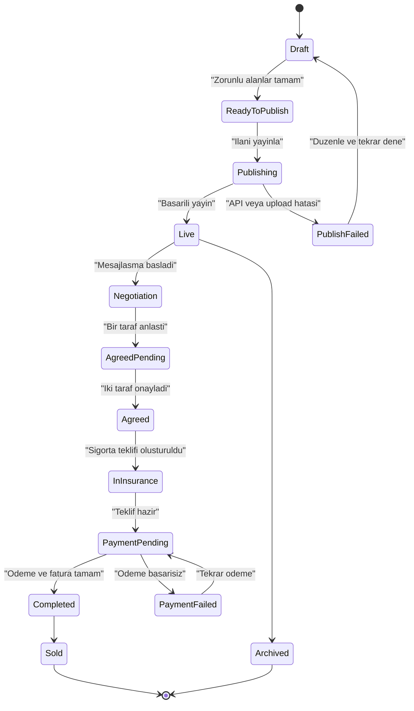
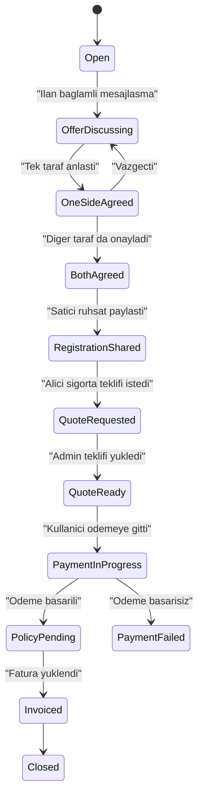
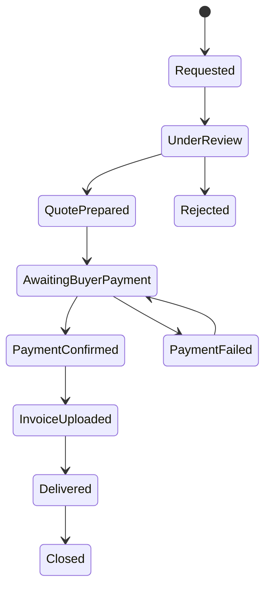

# Carloi V3 Ilan, Mesaj ve Sigorta Akisi

## 1. Kapsam

Bu dokuman Carloi V3 urununde su bagli akislari tek bir zincir olarak tanimlar:

- Garajdaki aractan ilan olusturma
- Ilan karti ve ilan detay deneyimi
- Ilan baglamli mesajlasma
- Iki tarafli "Anlastik" onayi
- Ruhsat bilgisi paylasimi
- Sigorta teklifi olusturma
- Garanti Sanal POS 3D Secure odeme
- Fatura ve poliçe teslimi

Bu akisin amaci, kullaniciyi ilan paylasimindan guvenli sigorta ve odeme surecine kadar yonlendiren net bir urun mantigi kurmaktir.

Not:

- Mevcut backend korunur.
- Buradaki akisin bir kismi mevcut endpointlerle calisir, bir kismi icin ek endpoint gerekir.
- Farkli bir kisinin araci icin satis yapma, yetki belgesi ve e-Devlet onayi gibi hukuki konular uygulama icinde acik uyari ile gosterilmelidir.

## 2. Temel Urun Kurallari

- Kullanici ilani kendi hesabindaki iletisim bilgileriyle acar.
- Ilan olusturma ekraninda farkli telefon numarasi veya farkli kisi adina iletisim bilgisi girilemez.
- Arac garajdan secildiyse marka, model, paket, yil, kilometre ve mevcut medya otomatik onerilir.
- Kullanici fiyat, aciklama, konum, ilave medya ve eksik teknik alanlari tamamlar.
- Arac sahibinin farkli bir kisi olmasi veya temsil yetkisi bulunmamasi halinde mevzuat uyari katmani zorunlu gosterilir.
- "Ara" aksiyonu yalnizca hesaptaki dogrulanmis iletisim kanalini kullanir.
- "Mesaj at" aksiyonu her zaman ilan baglamli sohbet acar.
- "Anlastik" yalnizca ilan baglamli sohbetlerde aktif olur.
- Iki taraf da anlastik durumunu onaylamadan ruhsat paylasim adimi acilmaz.
- Ruhsat bilgisi yalnizca gerekli taraflara, gerekli anda ve loglanarak paylasilir.
- Sigorta odeme akisi yalnizca anlasilan ve ruhsat bilgisi paylasilan ilan sohbetinde acilir.

## 3. UX Flow

### 3.1 Ilan Paylasimi

#### Giris Noktalari

- Garajim > Arac detayi > `Araci ilana cikar`
- Olustur > `Ilan gonderisi`
- Profil veya arac profili icinden `Ilan olustur`

#### Kullanici Akisi

1. Kullanici ilan turu olarak `Ilan gonderisi` secer.
2. Eger garajdan bir arac secilmis ise arac bilgileri otomatik doldurulur.
3. Kullanici su alanlari kontrol eder veya tamamlar:
   - fiyat
   - aciklama
   - konum
   - medya
   - plaka gosterim ayari
   - boya / degisen / tramer / ekspertiz / OBD alanlari
4. Sistem hesap iletisim bilgisini otomatik gosterir:
   - telefon
   - e-posta
5. Kullanici farkli numara veya farkli iletisim kisisi giremez.
6. Sistem hukuki uyari karti gosterir:
   - aracin sahibi siz degilseniz temsil yetkiniz olmalidir
   - gerekiyorsa e-Devlet veya ilgili mevzuat kapsami sorumluluk size aittir
   - yaniltici ilan ve baskasina ait araci izinsiz satma yasaklanir
7. Kullanici `Ilani yayinla` der.
8. Ilan feed icinde ve listing yuzeylerinde yayinlanir.

#### UX Detaylari

- Arac secilmemisse kullanici yine manuel ilan acabilir; ancak manuel akista daha fazla alan ister.
- Garajdan gelen veriler "otomatik dolduruldu" etiketi ile gosterilir.
- Eksik teknik bilgi varsa bos bir alan degil, "Belirtilmedi" satiri gosterilir.
- Medya yukleme asamasi ilerleme gostergesiyle calisir.

### 3.2 Ilan Karti

#### Kart Icerigi

- medya carousel
- fiyat
- marka / model / paket / yil / km / plaka
- konum
- yayin saati
- `Detayli incele`
- `Ara`
- `Mesaj at`

#### Kart Davranisi

- `Detayli incele` listing detail sayfasina gider.
- `Ara` hesapta dogrulanmis telefon varsa arama niyetini baslatir.
- `Mesaj at` ilan kartini sohbet input alanina pinli sekilde tasir.
- Plaka gizli ise maskeli gosterim kullanilir.
- Ticari hesap ise ticari rozet ayrica gosterilir.

### 3.3 Detayli Incele

Detay sayfa sahibinden benzeri detay tablosu mantiginda calisir.

#### Alanlar

- medya galerisi
- fiyat
- genel aciklama
- teknik bilgiler tablosu
  - marka
  - model
  - paket
  - yil
  - km
  - yakit
  - sanziman
  - kasa tipi
  - cekis
  - motor
  - renk
- boya / degisen / tramer / ekspertiz ozeti
- donanim listesi
- OBD ve ekspertiz alanlari varsa bunlarin ozeti
- konum
- satıcı / profil ozeti
- yasal sorumluluk uyarisi

#### Yasal Uyari Icerigi

- ilan bilgilerinin dogrulugundan satici sorumludur
- aracin sahipligi ve temsil yetkisi saticiya aittir
- Carloi aracin fiziksel durumu ve satis sonucunu garanti etmez
- sigorta ve odeme adimlari ayrica resmi ve finansal sureclere tabidir

### 3.4 Mesaj At ve Ilan Sohbeti

#### Baslangic

1. Alici `Mesaj at` der.
2. Sistem listing conversation bulur veya olusturur.
3. Sohbet ekraninda input ustunde pinli ilan karti gorunur.
4. Alicinin ilk mesaji ilan karti ile birlikte satıcıya gider.

#### Sohbet Deneyimi

- sohbetin en ustunde ilan ozeti sabit gorunur
- ilan baglamli sohbet oldugu net sekilde etiketlenir
- taraflar medya, normal mesaj, gonderi karti ve ilan karti paylasabilir
- `Anlastik` butonu sohbet header’inda yer alir

### 3.5 Anlastik Akisi

1. Taraflardan biri `Anlastik` der.
2. Sohbet icinde sistem durumu gosterir:
   - `Alici onayi bekleniyor`
   - `Satici onayi bekleniyor`
3. Iki taraf da `Anlastik` onayi verirse sohbet durumu:
   - `Iki taraf anlasti`
4. Bu noktada `Ruhsat bilgisi paylas` adimi acilir.

#### Kurallar

- Tek tarafli onay satis surecini baslatmaz.
- Ilan satildiyse fakat diger taraf onaylamadiysa durum `Kismi mutabakat` olarak kalir.
- Iptal veya vazgecme halinde anlasma durumu geri alinabilir, ancak audit log tutulur.

### 3.6 Ruhsat Paylasim Akisi

1. Satici ruhsat bilgisini girer veya kayitli ruhsat dokumanindan secer.
2. Sistem ruhsat verisini onizleme karti olarak gosterir.
3. Alici sohbet icinde bu ruhsat kartini gorur.
4. Ruhsat kartinin altinda `Sigorta teklifi olustur` butonu aktif olur.

#### Ruhsat Karti Icerigi

- arac temel bilgisi
- ruhsat seri / belge ozeti
- ruhsat sahibi / unvan
- plaka
- tescil tarihi
- gerekli yasal not

#### Guvenlik Kurallari

- Ruhsat verisinin sadece gerekli alanlari gosterilir.
- Tam belge gosterimi hassas veri kurallarina gore kisitlanir.
- Ruhsat karti ekran goruntusu ve log riskleri icin sistem uyarisi bulunur.

### 3.7 Sigorta Teklifi Akisi

1. Alici `Sigorta teklifi olustur` der.
2. Admin sigorta panelinde yeni istek olusur.
3. Admin su alanlari gorur:
   - alici
   - satıcı
   - arac
   - ruhsat bilgileri
   - ilan bilgileri
   - sohbet baglami
4. Admin teklif PDF yukler.
5. Admin teklif tutarini girer.
6. Sistem aliciya bildirim gonderir.
7. Alici PDF gorur ve `Devam et` der.
8. Garanti Sanal POS 3D Secure odeme akisi baslar.
9. Odeme sonucu admin panelde islenir.
10. Admin fatura PDF yukler.
11. Sistem kullaniciya:
   - mail
   - uygulama ici Carloi mesaji
   gonderir.

## 4. UI Ekranlari

### 4.1 Mobil / Web Kullanici Yuzeyleri

#### Ilan

- `CreateListingWizard`
- `ListingPreview`
- `ListingPublishResult`
- `ListingCard`
- `ListingDetail`
- `ListingTechnicalSheet`
- `ListingLegalWarningSheet`

#### Mesaj

- `ListingConversation`
- `ListingPinnedCard`
- `AgreementStatusBanner`
- `RegistrationShareComposer`
- `RegistrationCard`
- `InsuranceRequestStatusCard`
- `InsuranceQuoteViewer`
- `InsurancePaymentResult`

#### Sigorta / Bildirim

- `InsuranceQuoteAvailableNotification`
- `InvoiceAvailableNotification`
- `InsuranceTimeline`

### 4.2 Admin Yuzeyleri

- `InsuranceRequestQueue`
- `InsuranceRequestDetail`
- `QuoteUploadPanel`
- `PaymentStatusPanel`
- `InvoiceUploadPanel`
- `DeliveryStatusPanel`

## 5. Gerekli Backend Endpointleri

Bu bolum ikiye ayrilir:

- mevcut backend’de bulunan ve kullanilabilecek endpointler
- V3 UX’i tam karsilamak icin eklenmesi gereken endpointler

### 5.1 Mevcut Kullanilabilir Endpointler

#### Ilan / Gonderi / Medya

- `POST /api/posts`
- `DELETE /api/posts/:postId`
- `POST /api/posts/:postId/sold`
- `GET /api/public/posts/:postId`
- `GET /api/public/listings/:postId`
- `POST /api/media/upload`

#### Konusma

- `POST /api/conversations/direct`
- `POST /api/conversations/listing`
- `POST /api/conversations/group`
- `POST /api/conversations/:conversationId/messages`
- `PATCH /api/conversations/:conversationId/messages/:messageId`
- `POST /api/conversations/:conversationId/messages/:messageId/delete`
- `POST /api/conversations/:conversationId/agreement`
- `POST /api/conversations/:conversationId/registration/share`
- `POST /api/conversations/:conversationId/insurance/pay`

#### Satis ve Sigorta

- `POST /api/sales/:listingId/start`
- `POST /api/sales/:listingId/ack-safe-payment`
- `POST /api/sales/:listingId/ready-for-notary`
- `POST /api/sales/:listingId/complete`
- `POST /api/payment/initiate`
- `GET /api/payment/session/:paymentReference`
- `POST /api/billing/garanti/callback`
- `POST /api/payments/insurance/callback`

#### Admin Sigorta / Odeme

- `GET /api/admin/deals`
- `POST /api/admin/deals/:conversationId/quote`
- `POST /api/admin/deals/:conversationId/policy`
- `GET /api/admin/payments`
- `GET /api/admin/payments/:paymentId`

### 5.2 V3 Icin Eklenmesi Gereken Endpointler

#### Ilan Listeleme ve Detay

- `GET /api/listings`
  - feed ve listing tab’i icin filtreli liste
- `GET /api/listings/:listingId`
  - detail sayfa icin normalize response
- `GET /api/listings/:listingId/technical`
  - teknik tablo, donanim, ekspertiz, OBD ozeti
- `POST /api/listings/:listingId/contact-attempt`
  - ara butonu audit kaydi

#### Garajdan Ilan Olusturma

- `GET /api/garage/vehicles/:vehicleId/listing-draft`
  - arac secilince otomatik doldurulacak alanlar

#### Konusma Inbox ve Detay

- `GET /api/conversations`
  - inbox listesi
- `GET /api/conversations/:conversationId`
  - message list, pinned cards, agreement state
- `POST /api/conversations/:conversationId/read`
  - okundu durumu
- `GET /api/conversations/:conversationId/agreement-status`
  - iki tarafli onay durumu
- `GET /api/conversations/:conversationId/registration`
  - paylasilan ruhsat karti ozeti

#### Sigorta Durumu

- `GET /api/conversations/:conversationId/insurance-status`
  - teklif var mi, odeme bekliyor mu, fatura yuklendi mi
- `GET /api/conversations/:conversationId/insurance-quote`
  - kullanici tarafi quote metadata ve PDF linki
- `GET /api/conversations/:conversationId/invoice`
  - kullanici tarafi fatura metadata ve PDF linki

#### Admin Sigorta Paneli

- `GET /api/admin/deals/:conversationId`
  - tek istek detay payload’i
- `POST /api/admin/deals/:conversationId/quote-file`
  - teklif PDF upload
- `POST /api/admin/deals/:conversationId/invoice-file`
  - fatura PDF upload
- `POST /api/admin/deals/:conversationId/notify`
  - manuel bildirim gonderimi

#### Bildirimler

- `GET /api/notifications`
- `POST /api/notifications/:notificationId/read`

## 6. State Machine

### 6.1 Listing State Machine



### 6.2 Conversation State Machine



### 6.3 Insurance Admin State Machine



## 7. Error State Tasarimi

### 7.1 Ilan Olusturma Hatalari

- `Arac bilgileri eksik`
  - kullaniciya eksik alan listesi gosterilir
- `Medya yuklenemedi`
  - tekrar dene butonu
- `Konum secilemedi`
  - manuel konum girişi sunulur
- `Iletisim bilgisi dogrulanmamis`
  - ayarlar > hesap guvenlik yonlendirmesi
- `Yasal uyari onayi verilmedi`
  - yayinlama bloklanir

### 7.2 Ilan Karti / Detay Hatalari

- `Ilan kaldirilmis veya pasif`
  - profesyonel empty state
- `Teknik bilgiler yuklenemedi`
  - ana kart gosterilir, teknik tablo yerine uyarı
- `Medya acilamadi`
  - placeholder image degil, temiz media unavailable karti

### 7.3 Mesajlasma Hatalari

- `Sohbet olusturulamadi`
  - tekrar dene + daha sonra dene
- `Mesaj gonderilemedi`
  - local retry state
- `Ilan karti baglanamadi`
  - mesaj gidebilir, ama kart baglami icin uyari gosterilir

### 7.4 Anlasma ve Ruhsat Hatalari

- `Karsi taraf onayi bekleniyor`
  - disabled CTA
- `Ruhsat bilgisi eksik`
  - saticiya tamamla gorevi
- `Ruhsat paylasimi basarisiz`
  - tekrar gonder

### 7.5 Sigorta Hatalari

- `Sigorta teklifi henuz hazir degil`
  - timeline durum karti
- `Teklif PDF yuklenemedi`
  - admin yeniden yukleme
- `Odeme basarisiz`
  - tekrar odeme ve destek butonu
- `Odeme beklemede`
  - polling veya status yenile
- `Fatura henuz hazir degil`
  - bilgi karti
- `Mail gonderilemedi`
  - uygulama ici teslim basariliysa kullaniciya bildirim devam eder

### 7.6 Offline / Network Hatalari

- `Internet baglantisi yok`
  - offline state
- `Sunucuya ulasilamiyor`
  - gecici kesinti mesaji
- `Oturum suresi doldu`
  - yeniden giris akisi
- `Bu islem icin yetkiniz yok`
  - yetki uyarisi

## 8. API Response Onerileri

### 8.1 Listing Detail Ozet Payload

```json
{
  "success": true,
  "listing": {
    "id": "listing_123",
    "status": "live",
    "price": 1200000,
    "currency": "TRY",
    "locationLabel": "Istanbul / Kadikoy",
    "publishedAt": "2026-04-26T09:30:00.000Z",
    "seller": {
      "id": "user_1",
      "username": "ornekhesap",
      "displayName": "Ornek Kullanici",
      "isCommercial": false
    },
    "vehicle": {
      "id": "veh_1",
      "brand": "Toyota",
      "model": "Corolla",
      "trim": "1.6 Dream",
      "year": 2021,
      "km": 42000,
      "plateMasked": "34 ABC ***"
    },
    "technicalSheet": {},
    "equipment": [],
    "inspection": {},
    "legalWarnings": []
  }
}
```

### 8.2 Insurance Status Ozet Payload

```json
{
  "success": true,
  "insurance": {
    "conversationId": "conv_1",
    "status": "quote_ready",
    "quoteAmount": 18500,
    "currency": "TRY",
    "quotePdfUrl": "https://...",
    "paymentReference": "pay_ref_123",
    "invoicePdfUrl": null,
    "updatedAt": "2026-04-26T10:15:00.000Z"
  }
}
```

## 9. Uygulama Ici Kopya Onerileri

### 9.1 Ilan Uyarisi

`Bu ilandaki iletişim bilgileri hesabınızdaki doğrulanmış bilgilerden alınır. Farklı bir kişi adına satış yapıyorsanız gerekli yetki ve mevzuat sorumluluğu size aittir.`

### 9.2 Anlasma Durumu

- `Sen onayladin, karsi tarafin onayi bekleniyor.`
- `Iki taraf da anlasti. Ruhsat bilgisi paylasimina gecilebilir.`

### 9.3 Sigorta Durumu

- `Sigorta talebiniz alindi, teklif hazirlaniyor.`
- `Teklifiniz hazir. PDF dosyasini inceleyip odemeye devam edebilirsiniz.`
- `Odemeniz alindi. Fatura olusturulunca size bildirim gonderecegiz.`

## 10. V3 Uygulama Gelistirme Onceligi

1. Listing create + listing detail normalize endpointleri
2. Listing conversation inbox ve detail GET endpointleri
3. Agreement status ve registration read endpointleri
4. Insurance status endpointi
5. Admin deal detail + quote / invoice upload endpointleri
6. Notification read/list endpointleri

